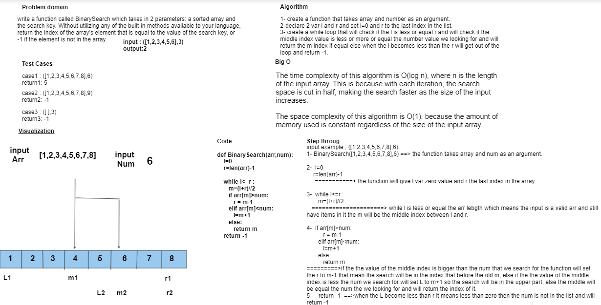

# Insert Shif Array

Write a function called BinarySearch which takes in 2 parameters: a sorted array and the search key. Without utilizing any of the built-in methods available to your language, return the index of the array’s element that is equal to the value of the search key, or -1 if the element is not in the array.

## Whiteboard Process



## Approach & Efficiency

time complexity O(log n) Space complexity O(1)

## Solution

<pre>

 ``` python
 def BinarySearch(arr,num):
    l=0
    r=len(arr)-1

    while l<=r :
       m=(l+r)//2
       if arr[m]>num:
          r = m-1
       elif arr[m]<num:
          l=m+1
       else:
          return m  
    return -1
 ```
</pre>