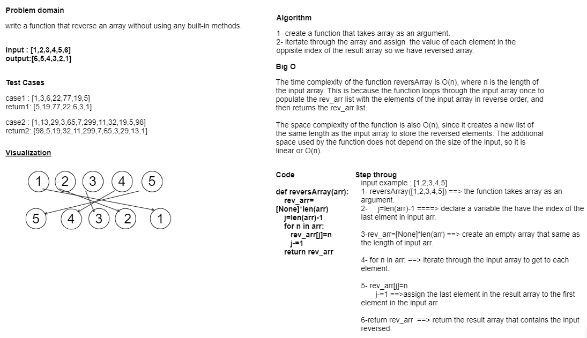

# Array Reverse

Write a function called reverseArray which takes an array as an argument. Without utilizing any of the built-in methods available to your language, return an array with elements in reversed order.

## Whiteboard Process



## Approach & Efficiency

The time complexity of the function reversArray is O(n), where n is the length of the input array. This is because the function loops through the input array once to populate the rev_arr list with the elements of the input array in reverse order, and then returns the rev_arr list.

The space complexity of the function is also O(n), since it creates a new list of the same length as the input array to store the reversed elements. The additional space used by the function does not depend on the size of the input, so it is linear or O(n).

## Solution

<pre>
```python
def reversArray(arr):
    rev_arr=[None]*len(arr)
    j=len(arr)-1
    for n in arr:
       rev_arr[j]=n
       j-=1
    return rev_arr
```
</pre>
