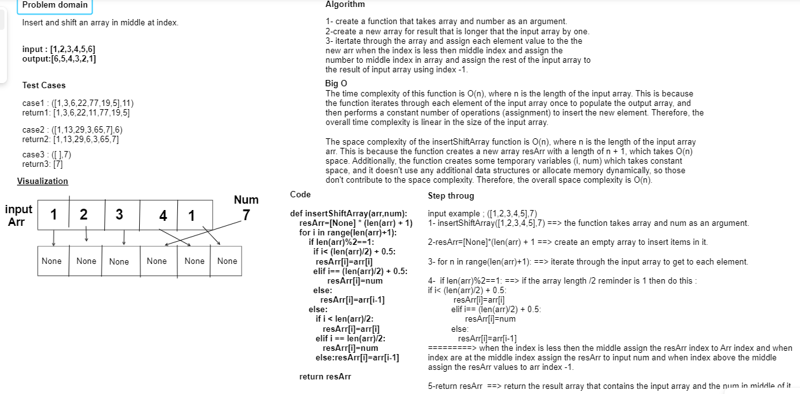

# Insert Shif Array

Create a function called insertShiftArray which takes in an array and a value to be added. Without utilizing any of the built-in methods available to your language, return an array with the new value added at the middle index.

## Whiteboard Process



## Approach & Efficiency

time: O(n) space: O(n)

## Solution

<pre>
```python
def insertShiftArray(arr,num):
    resArr=[None] * (len(arr) + 1)
    for i in range(len(arr)+1):
        if len(arr)%2==1:
          if i< (len(arr)/2) + 0.5:
           resArr[i]=arr[i]
          elif i== (len(arr)/2) + 0.5:
                resArr[i]=num
          else:
             resArr[i]=arr[i-1]
        else:
           if i < len(arr)/2:
              resArr[i]=arr[i]
           elif i == len(arr)/2:
              resArr[i]=num
           else:resArr[i]=arr[i-1]

    return resArr
```
</pre>