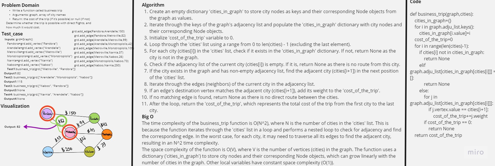

# Graph Business Trip

Write a function called business trip
Arguments: graph, array of city names
Return: the cost of the trip (if it’s possible) or null (if not)
Determine whether the trip is possible with direct flights, and how much it would cost.

## Contents

- [Graph Business Trip](#graph-business-trip)
- [Whiteboard Process](#whiteboard-process)
- [Approach & Efficiency](#approach--efficiency)
- [Solution](#solution)

## Whiteboard Process



## Approach & Efficiency

The time complexity of the business_trip function is O(N^2), where N is the number of cities in the 'cities' list. This is because the function iterates through the 'cities' list in a loop and performs a nested loop to check for adjacency and find the corresponding edge. In the worst case, for each city, it may need to traverse all its edges to find the adjacent city, resulting in an N^2 time complexity.

The space complexity of the function is O(V), where V is the number of vertices (cities) in the graph. The function uses a dictionary ('cities_in_graph') to store city nodes and their corresponding Node objects, which can grow linearly with the number of cities in the graph. Other local variables have constant space complexity (O(1)).

## Solution

```python
def business_trip(graph,cities):
    """this function tekes a graph and list of cities as arguments and return the cost of trip between those cities in the right order"""
    cities_in_graph={}
    for i in graph.adju_list.keys():
        cities_in_graph[i.value]=i
    cost_of_the_trip=0
    for i in range(len(cities)-1):
        if cities[i] not in cities_in_graph:
            return None
        elif graph.adju_list[cities_in_graph[cities[i]]] == []:
            return None
        else:
            for j in graph.adju_list[cities_in_graph[cities[i]]]:
                if j.vertex.value == cities[i+1]:
                    cost_of_the_trip+=j.weight
            if cost_of_the_trip == 0:
                return None
    return cost_of_the_trip
```
