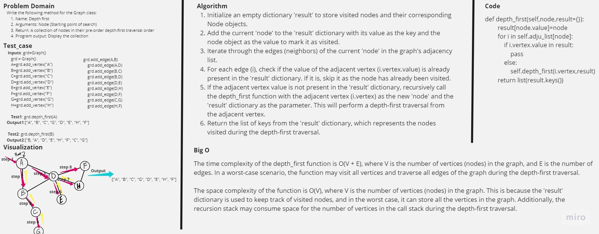

# Graph Depth First

Write the following method for the Graph class:
Name: Depth first
Arguments: Node (Starting point of search)
Return: A collection of nodes in their pre-order depth-first traversal order
Program output: Display the collection

## Contents

- [Graph Depth First](#graph-depth-first)
- [Whiteboard Process](#whiteboard-process)
- [Approach & Efficiency](#approach--efficiency)
- [Solution](#solution)

## Whiteboard Process



## Approach & Efficiency

The time complexity of the depth_first function is O(V + E), where V is the number of vertices (nodes) in the graph, and E is the number of edges. In a worst-case scenario, the function may visit all vertices and traverse all edges of the graph during the depth-first traversal.

The space complexity of the function is O(V), where V is the number of vertices (nodes) in the graph. This is because the 'result' dictionary is used to keep track of visited nodes, and in the worst case, it can store all the vertices in the graph. Additionally, the recursion stack may consume space for the number of vertices in the call stack during the depth-first traversal.

## Solution

```python
def depth_first(self,node,result={}):
        """this function used to traverse on a graph following depth first crateria starting from given node"""
        result[node.value]=node
        for i in self.adju_list[node]:
            if i.vertex.value in result:
                pass
            else:
                self.depth_first(i.vertex,result)
        return list(result.keys())
```
