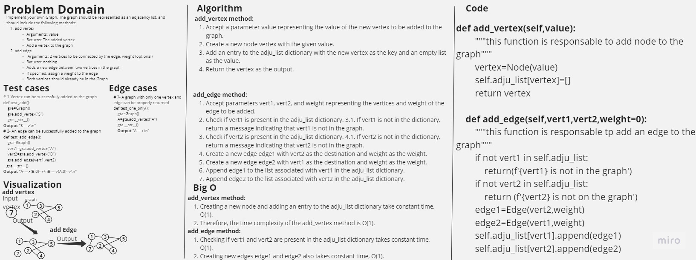

# Graphs

Write a function called repeated word that finds the first word to occur more than once in a string

## Contents

- [Graphs](#graphs)
- [Whiteboard Process](#whiteboard-process)
- [Approach & Efficiency](#approach--efficiency)
  - [Add vertex](#add-vertex)
  - [Add edge](#add-edge)
  - [Get vertics](#get-vertics)
  - [Get neighbors](#get-neighbors)
  - [Size](#size)
- [Solution](#solution)
  - [Add vertex](#add-vertex-code)
  - [Add edge](#add-edge-code)
  - [Get vertics](#get-vertics-code)
  - [Get neighbors](#get-neighbors-code)
  - [Size](#size-code)

## Whiteboard Process



## Approach & Efficiency

### Add Vertex

Creating a new node and adding an entry to the adju_list dictionary take constant time, O(1).
Therefore, the time complexity of the add_vertex method is O(1).

The space complexity for Add Vertex is also O(1), as they do not use additional space proportional to the input size.

### Add Edge

The time complexity of the all_words_count function is O(n), where n is the number of words in the input string. This is because the function iterates over each word in the string once and performs constant-time operations to update the word count in the words_count dictionary.

The space complexity for Add Edge is also O(1), as they do not use additional space proportional to the input size.

### Get Vertics

The adju_list.keys() method returns a view object representing the keys in the dictionary, which takes O(1) time.
Therefore, the time complexity of the get_vertics method is O(1).

The space complexity of the the_most_repeated_word_list function is O(n), where n is the number of unique words in the input string. This is because the function uses the all_words_count function, which creates a dictionary words_count to store the word counts, and in the worst case, all words in the string are unique and need to be stored in the dictionary. Additionally, the function returns a list of the most repeated words, which can have a maximum length of n in the worst case.

The space complexity for get_vertics is O(V), where V represents the number of vertices in the graph.

#### Get Neighbors

Checking if vertex is present in the adju_list dictionary takes constant time, O(1).
Iterating through the list of neighbors in the adju_list dictionary associated with the vertex takes O(deg(vertex)) time, where deg(vertex) represents the degree (number of neighbors) of the vertex.
Creating and appending the neighbor information to the res list also takes O(1) time per neighbor.
Therefore, the overall time complexity of the get_neighbors method is O(deg(vertex)).

The space complexity for get_neighbors is O(V), where V represents the number of vertices in the graph.

#### Size

The len(self.adju_list) operation returns the number of entries (vertices) in the adju_list dictionary, which takes O(1) time.
Therefore, the time complexity of the size method is O(1).

The space complexity for size is O(1).

## Solution

### Add Vertex code

```python
def add_vertex(self,value):
        """this function is responsable to add node to the graph"""
        vertex=Node(value)
        self.adju_list[vertex]=[]
        return vertex
```

### Add Edge code

```python
def add_edge(self,vert1,vert2,weight=0):
        """this function is responsable tp add an edge to the graph"""
        if not vert1 in self.adju_list:
            return(f'{vert1} is not in the graph')
        if not vert2 in self.adju_list:
            return (f'{vert2} is not on the graph')
        edge1=Edge(vert2,weight)
        edge2=Edge(vert1,weight)
        self.adju_list[vert1].append(edge1)
        self.adju_list[vert2].append(edge2)
```

### Get Vertics code

```python
def get_vertics(self):
        """this function returns all the vertex in the graph"""
        return self.adju_list.keys()
```

### Get Neighbors code

```python
def get_neighbors(self,vertex):
        """this function return all the neighbors of input vertex"""
        res=[]
        if not vertex in self.adju_list:
            return f'{vertex} in not in the graph'
        else:
            for i in self.adju_list[vertex]:
                res.append([i.vertex.value,i.weight])
        return res
```

### Size code

```python
def size(self):
        """this function is responsable of returning the size of the graph"""
        return len(self.adju_list)
```
