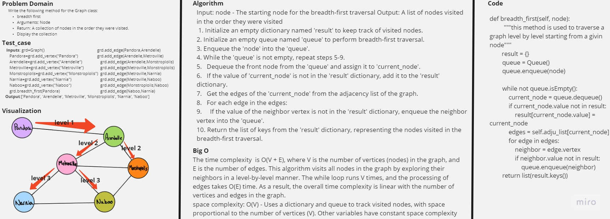

# Graph Breadth First

Write the following method for the Graph class:
breadth first
Arguments: Node
Return: A collection of nodes in the order they were visited.
Display the collection

## Contents

- [Graph Breadth First](#graph-breadth-first)
- [Whiteboard Process](#whiteboard-process)
- [Approach & Efficiency](#approach--efficiency)
- [Solution](#solution)

## Whiteboard Process



## Approach & Efficiency

The time complexity  is O(V + E), where V is the number of vertices (nodes) in the graph, and E is the number of edges. This algorithm visits all nodes in the graph by exploring their neighbors in a level-by-level manner. The while loop runs V times, and the processing of edges takes O(E) time. As a result, the overall time complexity is linear with the number of vertices and edges in the graph.

space complexity: O(V) - Uses a dictionary and queue to track visited nodes, with space proportional to the number of vertices (V). Other variables have constant space complexity (O(1)).

## Solution

```python
def breadth_first(self, node):
        """this method is used to traverse a graph level by level starting from a givin node"""
        result = {}
        queue = Queue()

        queue.enqueue(node)

        while not queue.isEmpty():
            current_node = queue.dequeue()
            if current_node.value not in result:
                result[current_node.value] = current_node

            edges = self.adju_list[current_node]
            for edge in edges:
                neighbor = edge.vertex
                if neighbor.value not in result:
                    queue.enqueue(neighbor)
        return list(result.keys())
```
