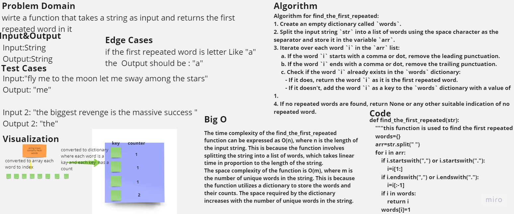

# Hash Map Repeated Word

Write a function called repeated word that finds the first word to occur more than once in a string

## Contents

- [HashMapReapetedWord](#hash-map-repeated-word)
- [Whiteboard Process](#whiteboard-process)
- [Approach & Efficiency](#approach--efficiency)
  - [Find First Repeated](#find-first-repeated)
  - [All Words Count](#all-words-count)
  - [Most Repeated Words](#most-repeated-words)
- [Solution](#solution)
  - [Find First Repeated](#find-first-repeated-code)
  - [All Words Count](#all-words-count-code)
  - [Most Repeated Words](#most-repeated-words-code)

## Whiteboard Process



## Approach & Efficiency

### Find First Repeated

The time complexity of the find_the_first_repeated function can be expressed as O(n), where n is the length of the input string. This is because the function involves splitting the string into a list of words, which takes linear time in proportion to the length of the string.

The space complexity of the function is O(m), where m is the number of unique words in the string. This is because the function utilizes a dictionary to store the words and their counts. The space required by the dictionary increases with the number of unique words in the string.

### All Words Count

The time complexity of the all_words_count function is O(n), where n is the number of words in the input string. This is because the function iterates over each word in the string once and performs constant-time operations to update the word count in the words_count dictionary.

The space complexity of the all_words_count function is also O(n), where n is the number of unique words in the input string. This is because the function creates a dictionary words_count to store the word counts, and in the worst case, all words in the string are unique and need to be stored in the dictionary.

### Most Repeated Words

The time complexity of the the_most_repeated_word_list function is O(n), where n is the number of words in the input string. This is because the function utilizes the all_words_count function to get the word counts, which has a time complexity of O(n). Then, it iterates over the word counts to find the most repeated words, which also takes O(n) time in the worst case.

The space complexity of the the_most_repeated_word_list function is O(n), where n is the number of unique words in the input string. This is because the function uses the all_words_count function, which creates a dictionary words_count to store the word counts, and in the worst case, all words in the string are unique and need to be stored in the dictionary. Additionally, the function returns a list of the most repeated words, which can have a maximum length of n in the worst case.

## Solution

### Find First Repeated code

```python
def find_the_first_repeated(str):
    """this function is used to find the first repeated word in the string that given"""
    words={}
    arr=str.split(" ")    
    for i in arr:
        if i.startswith(",") or i.startswith("."):
            i=i[1:]
        if i.endswith(",") or i.endswith("."):
            i=i[:-1]
        if i in words:
            return i 
        words[i]=1
```

### All Words Count code

```python
def all_words_count(str):
    """this function takes a string as an argument and returns the count of each word in the string"""
    words_count={}
    if str == "":
        return words_count
    arr=str.split(" ")
    for i in arr:
        if i.startswith(",") or i.startswith("."):
            i=i[1:]
        if i.endswith(",") or i.endswith("."):
            i=i[:-1]
        if i in words_count:
            words_count[i]+=1
        else:
            words_count[i]=1
    return words_count
```

### Most Repeated Words code

```python
def the_most_repeated_word_list(str):
    """this method responsable to return a list of the most repeated words on a string"""
    words_count=all_words_count(str) #cleaner code
    most_repeated=[]
    max=0
    for i in words_count:
        if words_count[i]>max:
            max=words_count[i]
            most_repeated=[]
        if words_count[i] == max:
            most_repeated.append(i)
    return most_repeated
```
