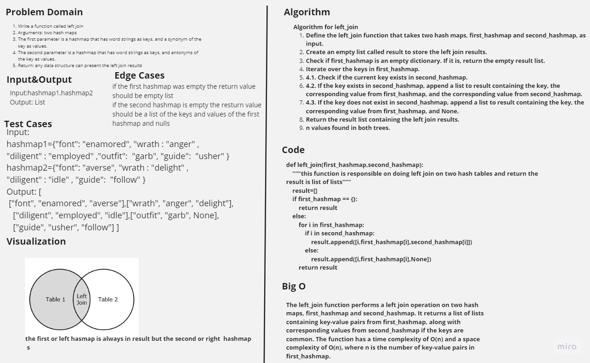

# Hashmap Left Join

Write a function called left join
Arguments: two hash maps
The first parameter is a hashmap that has word strings as keys, and a synonym of the key as values.
The second parameter is a hashmap that has word strings as keys, and antonyms of the key as values.

## Contents

- [Hashmap Left Join](#hashmap-left-join)
- [Whiteboard Process](#whiteboard-process)
- [Approach & Efficiency](#approach--efficiency)
- [Solution](#solution)

## Whiteboard Process



## Approach & Efficiency

The left_join function performs a left join operation on two hash maps, first_hashmap and second_hashmap. It returns a list of lists containing key-value pairs from first_hashmap, along with corresponding values from second_hashmap if the keys are common. The function has a time complexity of O(n) and a space complexity of O(n), where n is the number of key-value pairs in first_hashmap.

## Solution

```python
def left_join(first_hashmap,second_hashmap):
    """this function is responsible on doing left join on two hash tables and return the result is list of lists"""
    result=[]
    if first_hashmap == {}:
        return result
    else:

        for i in first_hashmap:
            if i in second_hashmap:
                result.append([i,first_hashmap[i],second_hashmap[i]])
            else:
                result.append([i,first_hashmap[i],None])
        return result
```
