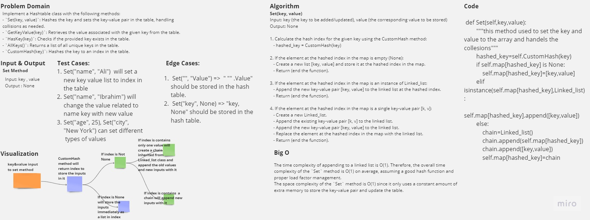

# Hash Table

Implement a Hashtable class with the following methods:

- `Set(key, value)`: Hashes the key and sets the key-value pair in the table, handling collisions as needed.
- `GetKeyValue(key)`: Retrieves the value associated with the given key from the table.
- `HasKey(key)`: Checks if the provided key exists in the table.
- `AllKeys()`: Returns a list of all unique keys in the table.
- `CustomHash(key)`: Hashes the key to an index in the table.

## Contents

- [HashTable](#hash-table)
- [Whiteboard Process](#whiteboard-process)
- [Approach & Efficiency](#approach--efficiency)
  - [Set Method](#set-method)
  - [GetKeyValue Method](#getkeyvalue-method)
  - [HasKey Method](#haskey-method)
  - [AllKeys Method](#allkeys-method)
  - [CustomHash Method](#customhash-method)
- [Solution](#solution)
  - [Set Method](#set-method-code)
  - [GetKeyValue Method](#getkeyvalue-method-code)
  - [HasKey Method](#haskey-method-code)
  - [AllKeys Method](#allkeys-method-code)
  - [CustomHash Method](#customhash-method-code)

## Whiteboard Process



## Approach & Efficiency

### Set Method

The `Set` method hashes the key to get the index in the table and handles collisions by using a linked list to store multiple key-value pairs in the same index. The time complexity of this method depends on the hash function implementation and the collision resolution strategy. In the provided implementation, the collision handling involves checking if the index already contains a linked list. If it does, the key-value pair is appended to the existing list, otherwise, a new list is created. The time complexity of appending to a linked list is O(1). Therefore, the overall time complexity of the `Set` method is O(1) on average, assuming a good hash function and proper load factor management.

The space complexity of the `Set` method is O(1) since it only uses a constant amount of extra memory to store the key-value pair and update the table.

### GetKeyValue Method

The `GetKeyValue` method retrieves the value associated with a given key from the table. It hashes the key to find the corresponding index and then traverses the linked list (if present) to find the matching key-value pair. The time complexity of this method depends on the number of elements in the linked list at the hashed index. In the worst case, when all keys in the table have collided and ended up in the same index, the time complexity becomes O(n), where n is the number of key-value pairs in the table. However, under normal circumstances and with a well-distributed hash function, the time complexity is closer to O(1) on average.

The space complexity of the `GetKeyValue` method is O(1) since it only uses a constant amount of extra memory to store temporary variables regardless of the input size.

### HasKey Method

The `HasKey` method checks if a given key exists in the table. It hashes the key to determine the index and then searches for the key in the linked list (if present) at that index. The time complexity of this method depends on the number of elements in the linked list at the hashed index. In the worst case, when all keys have collided, the time complexity is O(n), where n is the number of key-value pairs in the table. However, under normal circumstances, the time complexity is closer to O(1) on average.

The space complexity of the `HasKey` method is O(1) since it only uses a constant amount of extra memory to store temporary variables regardless of the input size.

### AllKeys Method

The `AllKeys` method returns a list of all unique keys in the table. It iterates over each index in the table and, if a linked list is present, traverses the list to collect the keys. The time complexity of this method depends on the number of elements in the table and the number of collisions. In the worst case, when all keys have collided and ended up in the same index, the time complexity becomes O(n), where n is the number of key-value pairs in the table. However, under normal circumstances, the time complexity is closer to O(k), where k is the number of unique keys in the table.

The space complexity of the `AllKeys` method is O(k), where k is the number of unique keys in the table, since it returns a list containing all the keys.

### CustomHash Method

The `CustomHash` method hashes the key based on the provided algorithm and returns the index in the table. The time complexity of this method depends on the complexity of the hash algorithm used. In the provided implementation, the algorithm performs a few constant-time operations, such as summing the ordinal values of specific characters in the key and applying a modulo operation. Therefore, the time complexity is O(1).

The space complexity of the `CustomHash` method is O(1) since it only uses a constant amount of extra memory to store temporary variables regardless of the input size.

## Solution

### Set Method code

```python
def Set(self, key, value):
    hashed_key = self.CustomHash(key)
    if self.map[hashed_key] is None:
        self.map[hashed_key] = [key, value]
    elif isinstance(self.map[hashed_key], LinkedList):
        self.map[hashed_key].append([key, value])
    else:
        chain = LinkedList()
        chain.append(self.map[hashed_key])
        chain.append([key, value])
        self.map[hashed_key] = chain
```

### GetKeyValue Method code

```python
def GetKeyValue(self, key):
    hashed_index = self.CustomHash(key)
    if self.map[hashed_index] is None:
        return "Not exist"
    elif isinstance(self.map[hashed_index], LinkedList):
        current = self.map[hashed_index].head
        while current:
            if current.value[0] == key:
                return f"The value of {key} is {current.value[1]}"
            current = current.next
        return "Not exist"
    return f"The value of {key} is {self.map[hashed_index][1]}"
```

### HasKey Method code

```python
def HasKey(self, key):
    hashed_index = self.CustomHash(key)
    if self.map[hashed_index] is None:
        return False
    elif isinstance(self.map[hashed_index], LinkedList):
        current = self.map[hashed_index].head
        while current:
            if current.value[0] == key:
                return True
            current = current.next
        return False
    return True
```

### AllKeys Method code

```python
def AllKeys(self):
    keys_list = []
    for i in self.map:
        if isinstance(i, LinkedList):
            current = i.head
            while current:
                keys_list.append(current.value[0])
                current = current.next
        else:
            keys_list.append(i[0])
    return keys_list
```

### CustomHash Method code

```python
def CustomHash(self, key):
    total = 0
    if key[0]:
        total += ord(key[0])
    if key[1]:
        total += ord(key[1])
    if key[2]:
        total += ord(key[2])
    total = int(math.log10(total))
    return total % self.size
```
