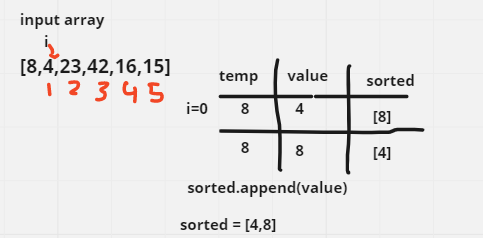
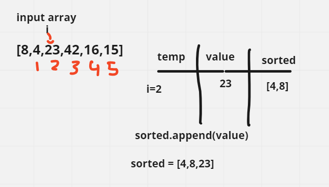
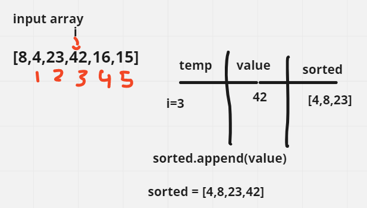
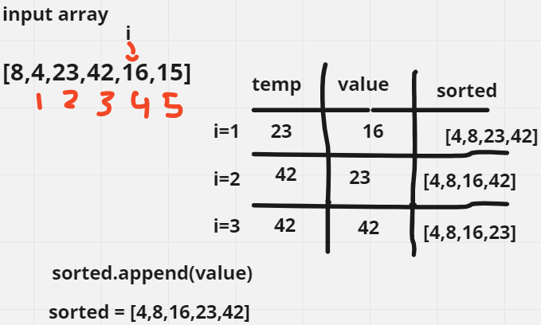
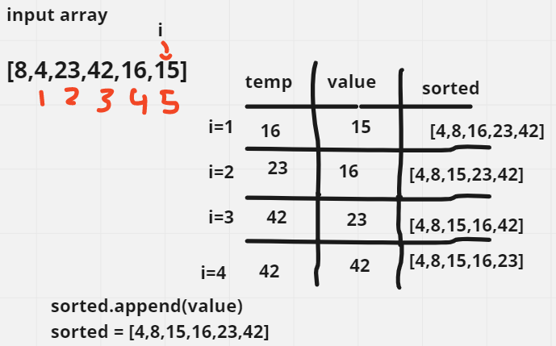

# Insertation Sort

Insertion Sort is a simple sorting algorithm that works by repeatedly inserting an element from the unsorted part of the array into its correct position in the sorted part of the array. It is called "insertion" sort because it involves inserting elements into their appropriate positions within the sorted subarray.

Pseudocode
```
    Insert(int[] sorted, int value)
  initialize i to 0
  WHILE value > sorted[i]
    set i to i + 1
  WHILE i < sorted.length
    set temp to sorted[i]
    set sorted[i] to value
    set value to temp
    set i to i + 1
  append value to sorted

InsertionSort(int[] input)
  LET sorted = New Empty Array
  sorted[0] = input[0]
  FOR i from 1 up to input.length
    Insert(sorted, input[i])
  return sorted
```

Trace
Sample Array: [8,4,23,42,16,15]

Pass 1:


In the first pass in the insertation sort we decalare a new array and we set the first index of it to the first value in the input array then we compatre between the first value of the new array and the value in this case it is the 8 and 4 and the 4 is less than 8 so we replace the 8 with 4 and we set the 8 to temp var then append it to the array.

pass 2:


in step 2 the value(23) is greater than both of the values of the sorted array so it is immediately apended at the tail.

pass 3:


in step 3 the value(42) is greater than all of the values of the sorted array so it is immediately apended at the tail.

pass 4:


in step 4 we notice that 16 is greater than some elements and less than others so in the first two steps we just incrementing i because the elemnts in less the value we will insert until we arrive to 23 we set the to 23 and replace the 23 in the array to 16 and then we set the value to temp wich is 23 and we repeat the same previous steps to get the array sorted again.

pass 5:


in step 5 we notice that 15 is greater than some elements and less than others so in the first two steps we just incrementing i because the elemnts in less the value we will insert until we arrive to 16 we set the to 16 and replace the 16 in the array to 16 and then we set the value to temp wich is 16 and we repeat the same previous steps to get the array sorted again.

## Efficency

    Time: O(n^2)
    The basic operation of this algorithim is iteration on each elemnt in the input array and call the insert function for it which has O(n) complexity. This will happen n * (2n) number of times…concluding the algorithm to be n squared.
    Space: O(n)
    we created a new array that we sorted the result in.