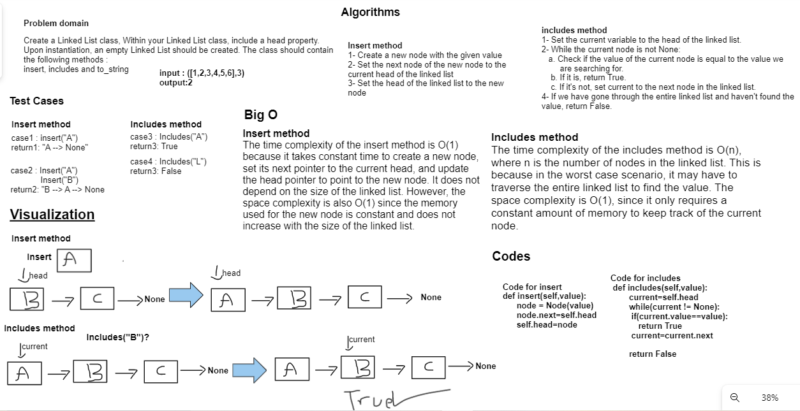

# linked list

Create a Linked List class, Within your Linked List class, include a head property.
Upon instantiation, an empty Linked List should be created. The class should contain the following methods
insert, includes and to_string

## Whiteboard Process



## Approach & Efficiency

Insert method
The time complexity of the insert method is O(1) because it takes constant time to create a new node, set its next pointer to the current head, and update the head pointer to point to the new node. It does not depend on the size of the linked list. However, the space complexity is also O(1) since the memory used for the new node is constant and does not increase with the size of the linked list.

Includes method
The time complexity of the includes method is O(n), where n is the number of nodes in the linked list. This is because in the worst case scenario, it may have to traverse the entire linked list to find the value. The space complexity is O(1), since it only requires a constant amount of memory to keep track of the current node.

## Solution

<pre>

 ``` python
def insert(self,value):
      node = Node(value)
      node.next=self.head
      self.head=node

    def includes(self,value):
        current=self.head
        while(current != None):
         if(current.value==value):
            return True
         current=current.next

        return False

        def __str__(self):
        output=""

        if self.head == None:
            output="Empty Linked List"
        else:
            current=self.head
            while(current):
                output+=f'{current.value} --> '
                current=current.next
            output+=" None"
        return(output)
 ```
</pre>