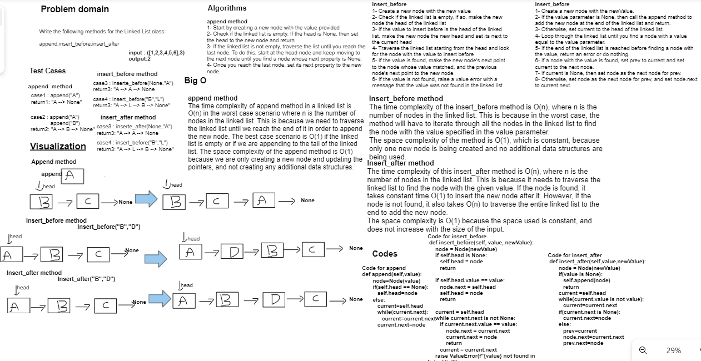

# linked list insertation

following methods for the Linked List class:

append,insert_before,insert_after

## Whiteboard Process



## Approach & Efficiency

append method
The time complexity of append method in a linked list is O(n) in the worst case scenario where n is the number of nodes in the linked list. This is because we need to traverse the linked list until we reach the end of it in order to append the new node. The best case scenario is O(1) if the linked list is empty or if we are appending to the tail of the linked list. The space complexity of the append method is O(1) because we are only creating a new node and updating the pointers, and not creating any additional data structures.

insert_before method
The time complexity of the insert_before method is O(n), where n is the number of nodes in the linked list. This is because in the worst case, the method will have to iterate through all the nodes in the linked list to find the node with the value specified in the value parameter.
The space complexity of the method is O(1), which is constant, because only one new node is being created and no additional data structures are being used.

insert_after method
The time complexity of this insert_after method is O(n), where n is the number of nodes in the linked list. This is because it needs to traverse the linked list to find the node with the given value. If the node is found, it takes constant time O(1) to insert the new node after it. However, if the node is not found, it also takes O(n) to traverse the entire linked list to the end to add the new node.
The space complexity is O(1) because the space used is constant, and does not increase with the size of the input.

## Solution

<pre>

 ``` python
    def append(self,value):
       node=Node(value)
       if(self.head == None):
          self.head=node
       else:
          current=self.head
          while(current.next):
             current=current.next
          current.next=node

    def insert_before(self, value, newValue):
     node = Node(newValue)
     if self.head is None:
        self.head = node
        return

     if self.head.value == value:
        node.next = self.head
        self.head = node
        return

     current = self.head
     while current.next is not None:
        if current.next.value == value:
            node.next = current.next
            current.next = node
            return
        current = current.next
     raise ValueError(f"{value} not found in linked list")

    def insert_after(self,value,newValue):
       node = Node(newValue)
       if(value is None):
          self.append(node)
          return
       current =self.head
       while(current.value is not value):
          current=current.next
       if(current.next is None):
          current.next=node
       else:
          prev=current
          node.next=current.next
          prev.next=node
    def delete_node(self,value):
       if(self.includes(value)):
         current=self.head
         if(current.value is value):
            self.head=current.next
            return
         while(current.next.value is not value):
            current=current.next
         prev=current
         current=current.next
         prev.next=current.next
       else:
          return False
 ```
</pre>