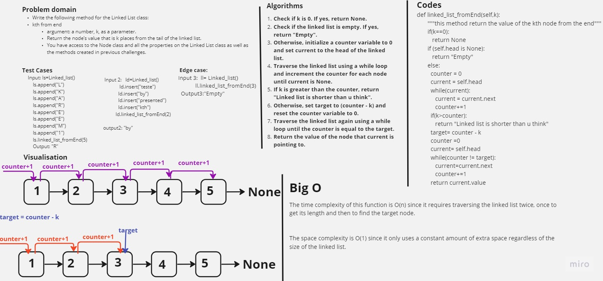

# Linked list kth from the back

Write the following method for the Linked List class:

kth from end
argument: a number, k, as a parameter.
Return the node’s value that is k places from the tail of the linked list.
You have access to the Node class and all the properties on the Linked List class as well as the methods created in previous challenges.

## Whiteboard Process



## Approach & Efficiency

The time complexity of this function is O(n) since it requires traversing the linked list twice, once to get its length and then to find the target node. The space complexity is O(1) since it only uses a constant amount of extra space regardless of the size of the linked list.

## Solution

<pre>
```python
def linked_list_fromEnd(self,k):
       """this method return the value of the kth node from the end"""
       if(k==0):
          return None
       if (self.head is None):
          return "Empty"
       else:
         counter = 0
         current = self.head
         while(current):
            current = current.next
            counter+=1
         if(k>counter):
            return "Linked list is shorter than u think"
         target= counter - k
         counter =0
         current= self.head
         while(counter != target):
            current=current.next
            counter+=1
         return current.value
```
</pre>