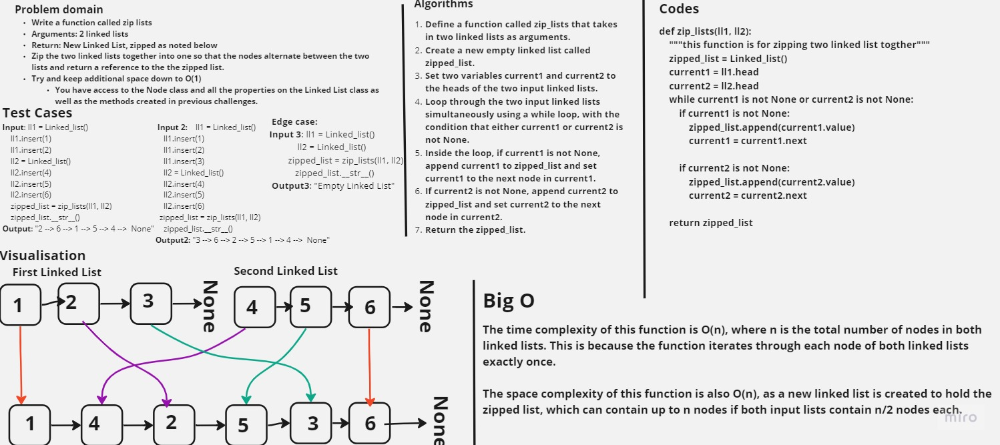

# linked list zip

Write a function called zip lists
Arguments: 2 linked lists
Return: New Linked List, zipped as noted below
Zip the two linked lists together into one so that the nodes alternate between the two lists and return a reference to the the zipped list.
Try and keep additional space down to O(1)
You have access to the Node class and all the properties on the Linked List class as well as the methods created in previous challenges.

## Whiteboard Process



## Approach & Efficiency

The time complexity of this function is O(n), where n is the total number of nodes in both linked lists. This is because the function iterates through each node of both linked lists exactly once.

The space complexity of this function is also O(n), as a new linked list is created to hold the zipped list, which can contain up to n nodes if both input lists contain n/2 nodes each.

## Solution

<pre>

 ``` python
    def zip_lists(ll1, ll2):
    """this function is for zipping two linked list togther"""
    zipped_list = Linked_list()
    current1 = ll1.head
    current2 = ll2.head

    while current1 is not None or current2 is not None:
        if current1 is not None:
            zipped_list.append(current1.value)
            current1 = current1.next

        if current2 is not None:
            zipped_list.append(current2.value)
            current2 = current2.next

    return zipped_list
 ```
</pre>