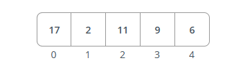
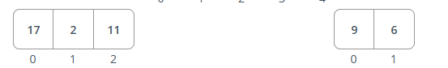
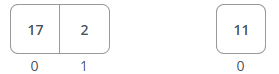
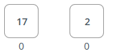
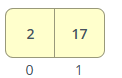
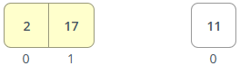
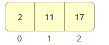
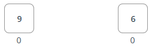
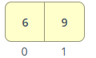
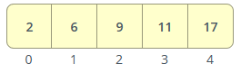

# Merge sort

* Initial array: [17, 2, 11, 9, 6]

* Since the array has more than one element, we proceed with the sorting process.

* Splitting the array into halves:

* Recursively sort the left and right subarrays:

* Splitting the left subarray:

* Since both subarrays have only one element, no further splitting is required.
* Merging the left subarray

* Recursively sort the left subarrays:

* Splitting the right subarray:

* Recursively sort the right subarray:
* Since both subarrays have only one element, no further splitting is required.
* Merging the left subarray:
    

* Merging the sorted subarrays:
