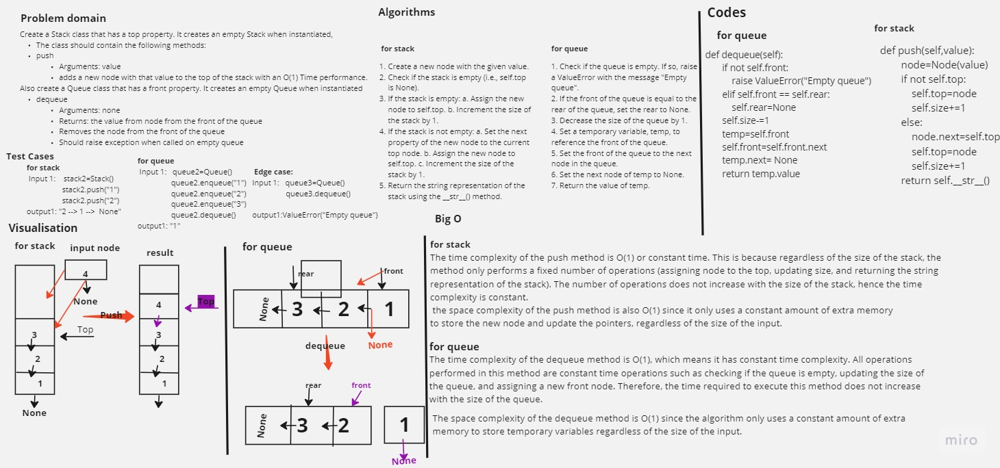

# Stack and Queues

Create a Stack class that has a top property. It creates an empty Stack when instantiated,
The class should contain the following methods:
push
Arguments: value
adds a new node with that value to the top of the stack with an O(1) Time performance.
Also create a Queue class that has a front property. It creates an empty Queue when instantiated
dequeue
Arguments: none
Returns: the value from node from the front of the queue
Removes the node from the front of the queue
Should raise exception when called on empty queue

## Whiteboard Process



## Approach & Efficiency

### Stack push method

The time complexity of the push method is O(1) or constant time. This is because regardless of the size of the stack, the method only performs a fixed number of operations (assigning node to the top, updating size, and returning the string representation of the stack). The number of operations does not increase with the size of the stack, hence the time complexity is constant.

the space complexity of the push method is also O(1) since it only uses a constant amount of extra memory to store the new node and update the pointers, regardless of the size of the input.

### Queue dequeue method

The time complexity of the dequeue method is O(1), which means it has constant time complexity. All operations performed in this method are constant time operations such as checking if the queue is empty, updating the size of the queue, and assigning a new front node. Therefore, the time required to execute this method does not increase with the size of the queue.

The space complexity of the dequeue method is O(1) since the algorithm only uses a constant amount of extra memory to store temporary variables regardless of the size of the input.

## Solution
#### Stack push method
<pre>

 ``` python
    def push(self,value):
        node=Node(value)
        if not self.top:
            self.top=node
            self.size+=1
        else:
            node.next=self.top
            self.top=node
            self.size+=1
        return self.__str__()
 ```
</pre>

#### Queue dequeue method
<pre>

 ``` python
     def dequeue(self):
        if not self.front:
            raise ValueError("Empty queue")
        elif self.front == self.rear:
            self.rear=None
        self.size-=1
        temp=self.front
        self.front=self.front.next
        temp.next= None
        return temp.value
 ```
</pre>