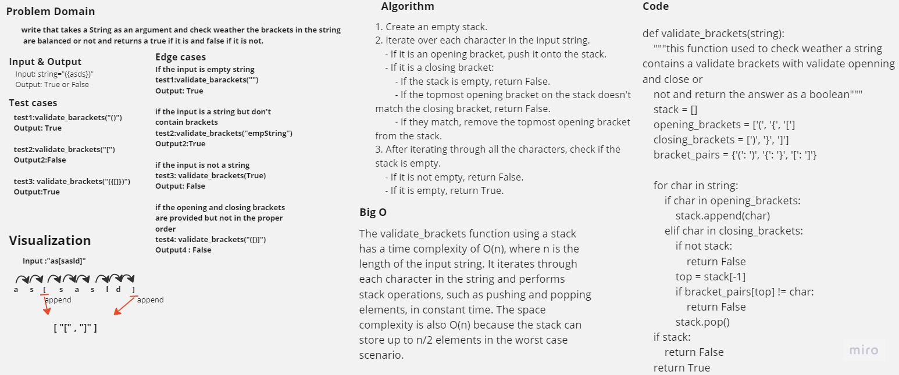

# Stack queue barckets

Write a function called validate brackets
Arguments: string
Return: boolean
representing whether or not the brackets in the string are balanced

## Whiteboard Process



## Approach & Efficiency

The validate_brackets function using a stack has a time complexity of O(n), where n is the length of the input string. It iterates through each character in the string and performs stack operations, such as pushing and popping elements, in constant time. The space complexity is also O(n) because the stack can store up to n/2 elements in the worst case scenario.

## Solution

<pre>

 ``` python
    def validate_brackets(string):
    """this function used to check weather a string contains a validate brackets with validate openning and close or 
    not and return the answer as a boolean"""
    stack = []
    opening_brackets = ['(', '{', '[']
    closing_brackets = [')', '}', ']']
    bracket_pairs = {'(': ')', '{': '}', '[': ']'}

    for char in string:
        if char in opening_brackets:
            stack.append(char)
        elif char in closing_brackets:
            if not stack:
                return False
            top = stack[-1]
            if bracket_pairs[top] != char:
                return False
            stack.pop()

    if stack:
        return False
    return True

 ```
</pre>

