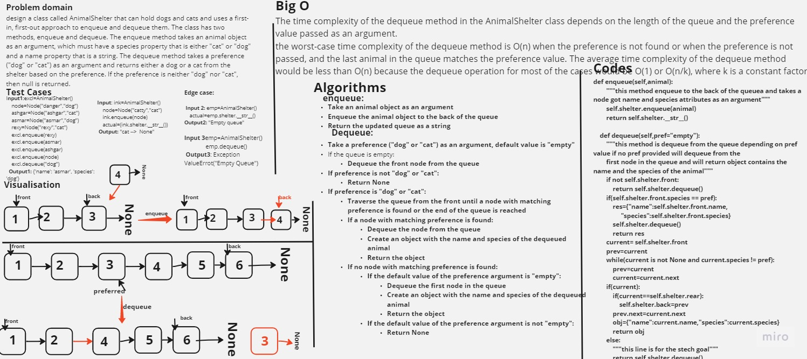

# Stack queue animal shelter

design a class called AnimalShelter that can hold dogs and cats and uses a first-in, first-out approach to enqueue and dequeue them. The class has two methods, enqueue and dequeue. The enqueue method takes an animal object as an argument, which must have a species property that is either "cat" or "dog" and a name property that is a string. The dequeue method takes a preference ("dog" or "cat") as an argument and returns either a dog or a cat from the shelter based on the preference. If the preference is neither "dog" nor "cat", then null is returned.

## Whiteboard Process



## Approach & Efficiency

The time complexity of the dequeue method is O(1)

The time complexity of the dequeue method in the AnimalShelter class depends on the length of the queue and the preference value passed as an argument.
the worst-case time complexity of the dequeue method is O(n) when the preference is not found or when the preference is not passed, and the last animal in the queue matches the preference value. The average time complexity of the dequeue method would be less than O(n) because the dequeue operation for most of the cases would be O(1) or O(n/k), where k is a constant factor.

## Solution

<pre>
```python
def enqueue(self,animal):
        """this method enqueue to the back of the queuea and takes a node got name and species attributes as an argument"""
        self.shelter.enqueue(animal)
        return self.shelter.__str__()
    
    def dequeue(self,pref="empty"):
        """this method is dequeue from the queue depending on pref value if no pref provided will dequeue from the 
        first node in the queue and will return object contains the name and the species of the animal"""
        if not self.shelter.front:
            return self.shelter.dequeue()
        if(self.shelter.front.species == pref):
            res={"name":self.shelter.front.name,
                 "species":self.shelter.front.species}
            self.shelter.dequeue()
            return res
        current= self.shelter.front
        prev=current
        while(current is not None and current.species != pref):
            prev=current
            current=current.next
        if(current):
            if(current==self.shelter.rear):
                self.shelter.back=prev
            prev.next=current.next
            obj={"name":current.name,"species":current.species}
            return obj
        else:
            """this line is for the stech goal"""
            return self.shelter.dequeue()
```
</pre>