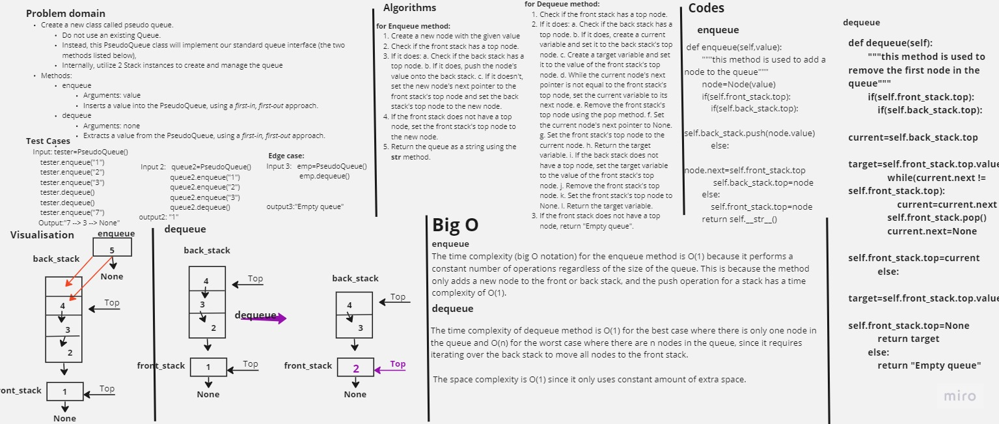

# Insert Shif Array

Create a new class called pseudo queue.
Do not use an existing Queue.
Instead, this PseudoQueue class will implement our standard queue interface (the two methods listed below),
Internally, utilize 2 Stack instances to create and manage the queue
Methods:
enqueue
Arguments: value
Inserts a value into the PseudoQueue, using a first-in, first-out approach.
dequeue
Arguments: none
Extracts a value from the PseudoQueue, using a first-in, first-out approach.

## Whiteboard Process



## Approach & Efficiency

#### Enqueue
The time complexity (big O notation) for the enqueue method is O(1) because it performs a constant number of operations regardless of the size of the queue. This is because the method only adds a new node to the front or back stack, and the push operation for a stack has a time complexity of O(1).

#### Dequeue

The time complexity of dequeue method is O(1) for the best case where there is only one node in the queue and O(n) for the worst case where there are n nodes in the queue, since it requires iterating over the back stack to move all nodes to the front stack.

 The space complexity is O(1) since it only uses constant amount of extra space.

## Solution

<pre>
```python
def enqueue(self,value):
        """this method is used to add a node to the queue"""
        node=Node(value)
        if(self.front_stack.top):
            if(self.back_stack.top):
                self.back_stack.push(node.value)
            else:
             node.next=self.front_stack.top
             self.back_stack.top=node
        else:
            self.front_stack.top=node
        return self.__str__()

    def dequeue(self):
        """this method is used to remove the first node in the queue"""
        if(self.front_stack.top):
            if(self.back_stack.top):
                current=self.back_stack.top
                target=self.front_stack.top.value
                while(current.next != self.front_stack.top):
                    current=current.next
                self.front_stack.pop()
                current.next=None
                self.front_stack.top=current
            else:
                target=self.front_stack.top.value
                self.front_stack.top=None
            return target
        else:
            return "Empty queue"
```
</pre>