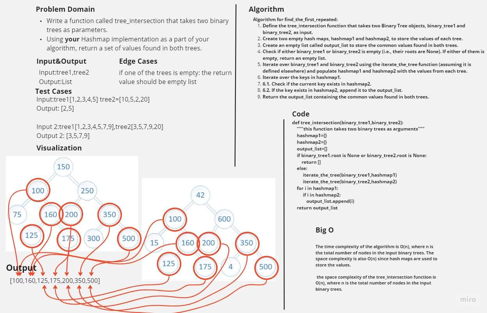

# Tree Intersection

Write a function called repeated word that finds the first word to occur more than once in a string

## Contents

- [Tree Intersection](#tree-intersection)
- [Whiteboard Process](#whiteboard-process)
- [Approach & Efficiency](#approach--efficiency)
- [Solution](#solution)

## Whiteboard Process



## Approach & Efficiency

The time complexity of the algorithm is O(n), where n is the total number of nodes in the input binary trees. The space complexity is also O(n) since hash maps are used to store the values.

the space complexity of the tree_intersection function is O(n), where n is the total number of nodes in the input binary trees.

## Solution

```python
def tree_intersection(binary_tree1,binary_tree2):
    """this function takes two binary trees as arguments"""
    hashmap1={}
    hashmap2={}
    output_list=[]
    if binary_tree1.root is None or binary_tree2.root is None:
        return []
    else:
         iterate_the_tree(binary_tree1,hashmap1)
         iterate_the_tree(binary_tree2,hashmap2)
    for i in hashmap1:
         if i in hashmap2:
            output_list.append(i)
    return output_list
```
