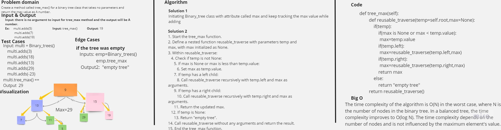

# Tree max

Write the following method for the Binary Tree class

find maximum value
Arguments: none
Returns: number
Find the maximum value stored in the tree. You can assume that the values stored in the Binary Tree will be numeric.

## Whiteboard Process



## Approach & Efficiency

The time complexity of the algorithm is O(N) in the worst case, where N is the number of nodes in the binary tree. In a balanced tree, the time complexity improves to O(log N). The time complexity depends on the number of nodes and is not influenced by the maximum element's value.

## Solution

<pre>

 ``` python
def tree_max(self):
        def reusable_traverse(temp=self.root,max=None):
            if(temp):
                if(max is None or max < temp.value):
                 max=temp.value
                if(temp.left):
                 max=reusable_traverse(temp.left,max)
                if(temp.right):
                 max=reusable_traverse(temp.right,max)
                return max
            else:
                return "empty tree"
        return reusable_traverse()
 ```
</pre>