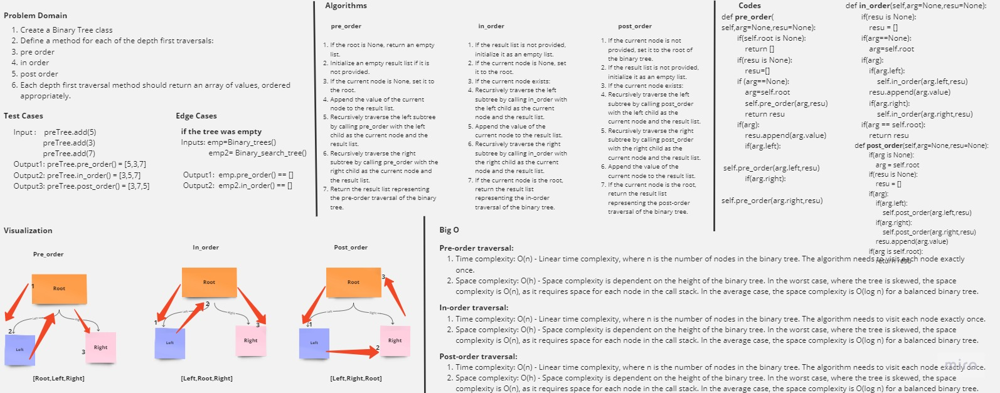

# Trees

#### Binary Tree

Create a Binary Tree class
Define a method for each of the depth first traversals:
pre order
in order
post order
Each depth first traversal method should return an array of values, ordered appropriately.

#### Binary Search Tree

Create a Binary Search Tree class
This class should be a sub-class (or your languages equivalent) of the Binary Tree Class, with the following additional methods:
Add
Arguments: value
Return: nothing
Adds a new node with that value in the correct location in the binary search tree.
Contains
Argument: value
Returns: boolean indicating whether or not the value is in the tree at least once.

## Whiteboard Process



## Approach & Efficiency

### Binary Tree

#### pre_order

Time complexity: O(n) - Linear time complexity, where n is the number of nodes in the binary tree. The algorithm needs to visit each node exactly once.
Space complexity: O(h) - Space complexity is dependent on the height of the binary tree. In the worst case, where the tree is skewed, the space complexity is O(n), as it requires space for each node in the call stack. In the average case, the space complexity is O(log n) for a balanced binary tree.

#### in_oreder

Time complexity: O(n) - Linear time complexity, where n is the number of nodes in the binary tree. The algorithm needs to visit each node exactly once.
Space complexity: O(h) - Space complexity is dependent on the height of the binary tree. In the worst case, where the tree is skewed, the space complexity is O(n), as it requires space for each node in the call stack. In the average case, the space complexity is O(log n) for a balanced binary tree.

#### post_order

Time complexity: O(n) - Linear time complexity, where n is the number of nodes in the binary tree. The algorithm needs to visit each node exactly once.
Space complexity: O(h) - Space complexity is dependent on the height of the binary tree. In the worst case, where the tree is skewed, the space complexity is O(n), as it requires space for each node in the call stack. In the average case, the space complexity is O(log n) for a balanced binary tree.

### Binary Search Tree

#### add method

Time complexity: O(h) - The time complexity of adding a node to a binary search tree is dependent on the height of the tree, which represents the longest path from the root to a leaf node. In the worst case, when the tree is skewed, the time complexity is O(n), where n is the number of nodes in the tree. This occurs when each new node is added as the left or right child of the previous node. In the average case for a balanced binary search tree, the time complexity is O(log n), where n is the number of nodes, as the tree's height is logarithmic.

Space complexity: O(1) - The space complexity of the add method is constant because it does not use any additional data structures that grow with the size of the input. It only creates a new node and traverses the tree without using extra space proportional to the input size.

#### contains method

Time complexity: O(h) - The time complexity of searching for a value in a binary search tree is dependent on the height of the tree, which represents the longest path from the root to a leaf node. In the worst case, when the tree is skewed, the time complexity is O(n), where n is the number of nodes in the tree. This occurs when each node has only one child, and the search needs to traverse all nodes in the tree. In the average case for a balanced binary search tree, the time complexity is O(log n), where n is the number of nodes, as the search narrows down the possible locations with each comparison.
Space complexity: O(1) - The space complexity of the contains method is constant because it does not use any additional data structures that grow with the size of the input. It only traverses the tree and compares values without using extra space proportional to the input size.

## Solution

<pre>

 ``` python
class Binary_trees:
    def __init__(self):
        self.root=None

    def adds(self,value,temp=None):
        node=Node(value)
        if(not self.root):
            self.root=node
            return
        if(temp is None):
            temp=self.root
        if(temp):
            if(not temp.left):
                temp.left=node
                return
            if(not temp.right):
                temp.right=node
                return
            else:
                temp=temp.left
                self.adds(value,temp)    
        
    def pre_order(self,arg=None,resu=None):
        if(self.root is None):
            return []
        if(resu is None):
            resu=[]
        if (arg==None):
            arg=self.root
            self.pre_order(arg,resu)
            return resu
        if(arg):
            resu.append(arg.value)
            if(arg.left):
               self.pre_order(arg.left,resu)
            if(arg.right):
                self.pre_order(arg.right,resu)

    def in_order(self,arg=None,resu=None):
        if(resu is None):
            resu = []
        if(arg==None):
            arg=self.root
        if(arg):
            if(arg.left):
                self.in_order(arg.left,resu)
            resu.append(arg.value)
            if(arg.right):
                self.in_order(arg.right,resu)
        if(arg == self.root):
            return resu
    
    def post_order(self,arg=None,resu=None):
        if(arg is None):
            arg = self.root
        if(resu is None):
            resu = []
        if(arg):
            if(arg.left):
                self.post_order(arg.left,resu)
            if(arg.right):
                self.post_order(arg.right,resu)
            resu.append(arg.value)
        if(arg is self.root):
            return resu

class Binary_search_tree(Binary_trees):
    def add(self,value,temp=None):
        node=Node(value)
        if(not self.root):
            self.root=node
            return
        if(temp==None):
            temp=self.root
        if(value>temp.value):
            if(temp.right):
                return self.add(value,temp.right)
            else:
                temp.right=node
                return
        elif(value<temp.value):
            if(temp.left):
                return self.add(value,temp.left)
            else:
                temp.left=node
                return
        else:
            return

    def contains(self,value,temp=None):
        if(not self.root):
            return "empty tree"
        if(temp == None):
            temp = self.root
        if(temp.value==value):
            return True
        elif(value<temp.value):
            if(temp.left):
             return self.contains(value,temp.left)
            else:
                return False
        else:
            if(temp.right):
             return self.contains(value,temp.right)
            else:
                return False
        return False
    
 ```
</pre>